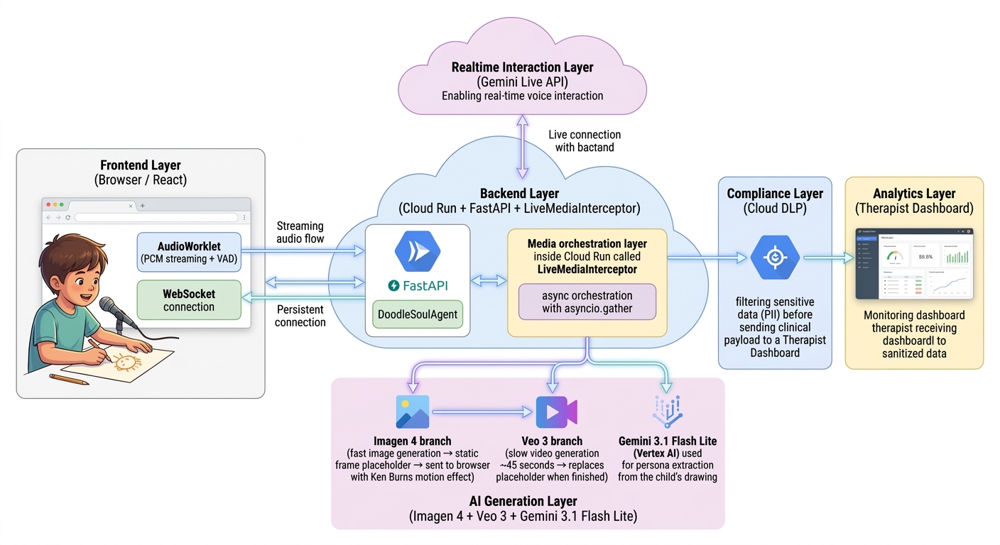
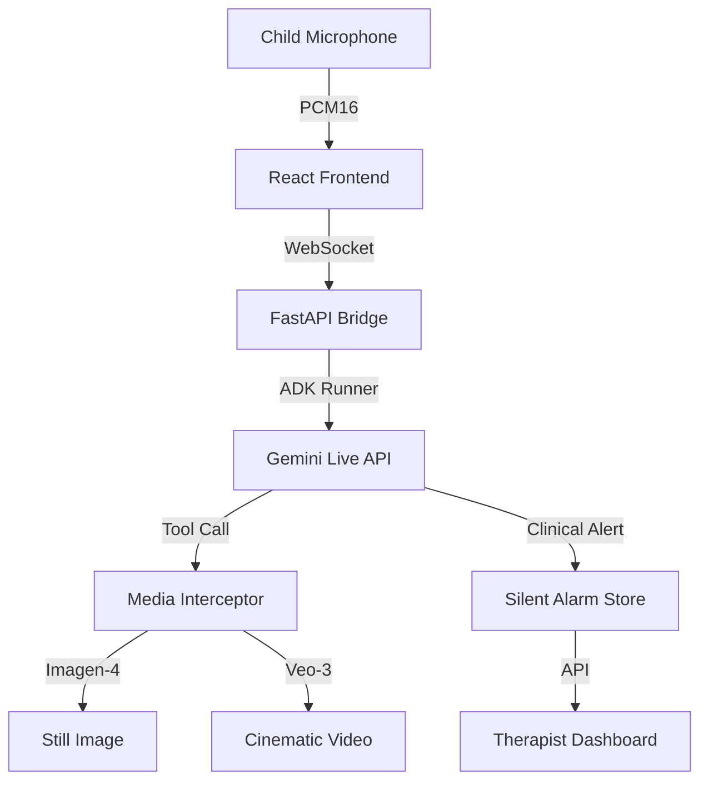

# DoodleSoul 🎨✨


[](https://geminiliveagentchallenge.devpost.com/)

> **🏆 Official Entrant of Gemini Live Agent Challenge**  
> _Transforming children's drawings into interactive imaginary friends via Multimodal Orchestration._  
> _A Dual-Audience Platform designed for Pediatric Therapy and Emotional Engagement._

<div align="center">

```text
    ██████╗  ██████╗  ██████╗ ██████╗ ██╗     ███████╗███████╗ ██████╗ ██╗   ██╗██╗     
    ██╔══██╗██╔═══██╗██╔═══██╗██╔══██╗██║     ██╔════╝██╔════╝██╔═══██╗██║   ██║██║     
    ██║  ██║██║   ██║██║   ██║██║  ██║██║     █████╗  ███████╗██║   ██║██║   ██║██║     
    ██║  ██║██║   ██║██║   ██║██║  ██║██║     ██╔══╝  ╚════██║██║   ██║██║   ██║██║     
    ██████╔╝╚██████╔╝╚██████╔╝██████╔╝███████╗███████╗███████║╚██████╔╝╚██████╔╝███████╗
    ╚═════╝  ╚═════╝  ╚═════╝ ╚═════╝ ╚══════╝╚══════╝╚══════╝ ╚═════╝ ╚═════╝ ╚══════╝
```

**Developed for the #GeminiLiveAgentChallenge**

**[🇧🇷 Leia o Blog Post Técnico (PT)](./Blog-post.md) | [🇺🇸 Read the Technical Deep Dive (EN)](./Blog-post-EN.md)**

</div>

---

## 📋 Table of Contents

- [🎯 Overview](#-overview)
- [🚀 Local Spin-Up (Judge's Guide)](#-local-spin-up-judges-guide)
- [✨ Key Features](#-key-features)
- [🏗️ Technical Architecture](#️-technical-architecture)
- [🔒 Security & Compliance (LGPD/ECA)](#-security--compliance)
- [🧠 Gemini Multimodal Integration](#-gemini-multimodal-integration)
- [🎥 Judge Test Script](#-judge-test-script)
- [🛠️ Technical Debt & Production Roadmap](#️-technical-debt--production-roadmap)

---

## 🎯 Overview

**DoodleSoul** addresses the "Clinical Blockade" in pediatric therapy. For children with ASD, ADHD, or Selective Mutism, traditional talk therapy is often perceived as a threat. 

Our solution uses **Technological Externalization**: the child draws a character, and we use the **Gemini Live API** to bring it to life. By projecting internal emotions onto a "digital puppet," we bypass defensive filters, transforming a passive patient into an active storyteller.

---

## 🚀 Local Spin-Up (Judge's Guide)

As per the hackathon rules (**"URL to your Public Code Repository"**), the following instructions allow for a complete local reproduction of the DoodleSoul experience. Only the backend is hosted on Google Cloud; for evaluation purposes, running the frontend locally ensures the best performance and microphone access.

### 1. Prerequisites
- **Python 3.11+** and **Node.js 20+**
- A Google Cloud Project with **Gemini Live API**, **Imagen**, and **Veo** enabled.

### 2. Repository & Environment
```bash
git clone https://github.com/matheus896/hackaton-google.git
cd hackaton-google
```
Create a `.env` file in the **root** and the **backend/** directory with your key:
```env
GOOGLE_API_KEY="YOUR_GEMINI_API_KEY"
ANIMISM_LIVE_MODE="adk"
ANIMISM_ADK_TOOL_MODE="text_fallback"
ANIMISM_DEBUG_MEDIA=0 # or 1 to enable media debug
ANIMISM_LOG_LEVEL=INFO

# local test
ANIMISM_ASSET_BASE_URL=http://localhost:8000
# cloud test
ANIMISM_ASSET_BASE_URL=https://animism-epic1-backend-pfxacy7otq-uc.a.run.app
```

### 3. Backend Setup
We recommend using `uv` for lightning-fast dependency management:
```bash
cd backend
pip install uv  # if not installed
uv pip install -r requirements.txt
uv run uvicorn app.main:app --host 0.0.0.0 --port 8000 --reload
```

### 4. Frontend Setup
```bash
cd ../frontend
npm install
npm run dev
```
**Access the platform at**: `http://localhost:5173/demo`

---

## ✨ Key Features

### 🎙️ Real-Time Dual-Audience Interaction
- **Child Side**: Continuous, low-latency voice conversation with their drawing.
- **Therapist Side**: A real-time dashboard receiving "Silent Alerts" and emotional state tracking via `report_clinical_alert`.

### 🖼️ Living Drawings Pipeline
- **Single-Shot Intake**: Capture physical drawings via camera.
- **Persona Derivation**: Gemini 3.1 Flash Lite extracts voice and personality traits from visual cues.
- **Cascading Media**: Imagen-4 generates an immediate still, followed by Veo-3 cinematic video.

---

## 🏗️ Technical Architecture



### The Full-Duplex Bridge
The heart of the system is a Python bridge that manages asynchronous upstream (microphone) and downstream (Gemini voice + media events) tasks using `asyncio.wait(FIRST_COMPLETED)`.



---

## 🔒 Security & Compliance

DoodleSoul was built with the **Brazil's Digital Statute for Children and Adolescents (2026)** and **LGPD** in mind:

| Provision | Implementation |
| :--- | :--- |
| **Privacy by Default** | Aggressive data minimization; no raw audio persistence. |
| **DLP Gatekeeper** | Mandatory redaction of PII before any clinical storage. |
| **Silent Alarm** | Clinical alerts are filtered from the child's channel (immersion safety). |
| **Audit Logs** | Immutable JSON audit logs for legal and clinical accountability. |

---

## 🧠 Gemini Multimodal Integration

### The Cascading Rendering Strategy (Latency Masking)
To solve the ~45s processing time of **Veo-3**, we implemented a cascading fallback:
1. **Imagen-4**: Generates a 1024x1024 still in < 5s.
2. **Ken Burns UI**: The frontend applies a CSS `zoom-and-pan` animation to the still.
3. **Veo-3**: The actual video replaces the animated still once ready.

---

## 🎥 Judge Test Script

1. **Access the Demo**: Open `http://localhost:5173/demo`.
2. **Start Adventure**: Upload a drawing and provide a name.
3. **Trigger Silent Alarm**: Speak: *"I am scared of the loud school bell."*
    - **Observe**: The voice remains warm; the Therapist Dashboard (right iframe) shows a private alert.
4. **Generate Magic**: Say *"Can you draw our adventure?"* then *"Can you make it move?"*.
    - **Observe**: The agent keeps talking while the video renders in the background.

---

## 🛠️ Technical Debt & Production Roadmap

To ensure the **"Architectural Illusion"** and low-latency delivery within the hackathon deadline, the following trade-offs were made:

1.  **In-Memory State**: Clinical session states (`ClinicalSessionStore`) are currently held in-memory, requiring the Cloud Run deployment to be restricted to `--max-instances 1`. In a production environment, this would be migrated to **Google Cloud Firestore**.
2.  **Asset Persistence**: Media assets (Imagen/Veo) are currently served from local disk. A production-ready version would utilize **Google Cloud Storage (GCS)** with signed URLs for secure, scalable delivery.
3.  **DLP Simulation**: The Cloud DLP mode currently uses a local simulator for quota reliability. Production would swap this for the **Google Cloud DLP API**.
4.  **CORS Policy**: CORS has been left open (`*`) exclusively to streamline the demo evaluation process across different local/cloud environments.

---

<div align="center">

### #GeminiLiveAgentChallenge

**DoodleSoul: Where imagination finds its voice.**

[⬆ Back to Top](#doodlesoul-)

</div>
